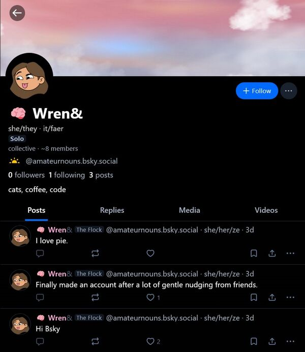
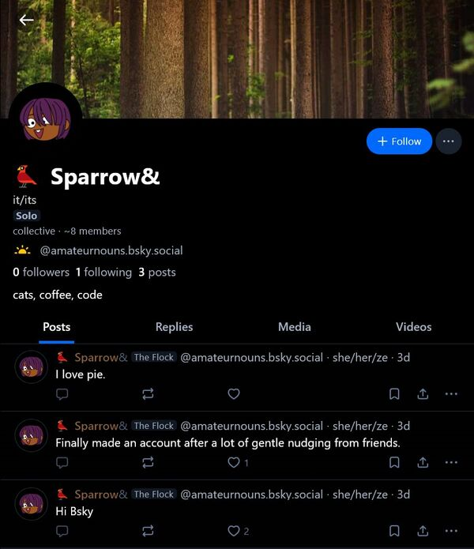
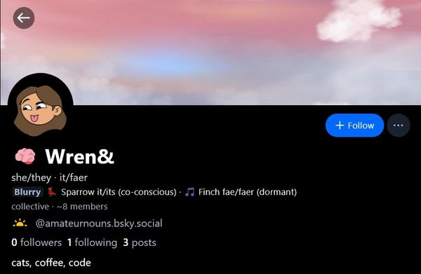
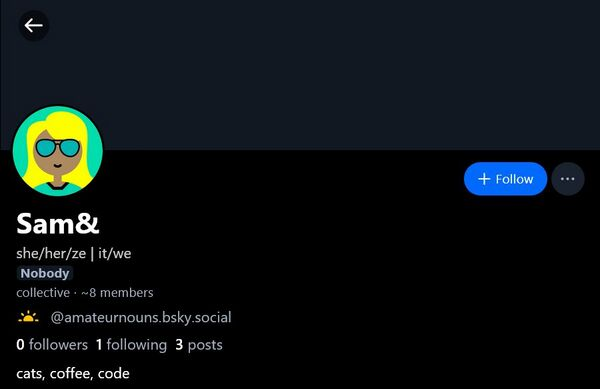
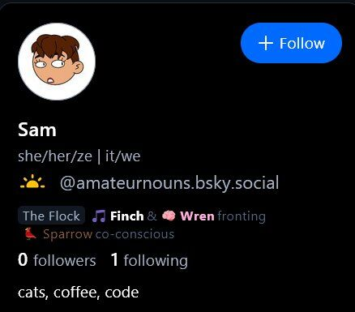
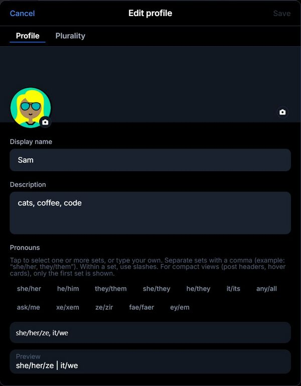
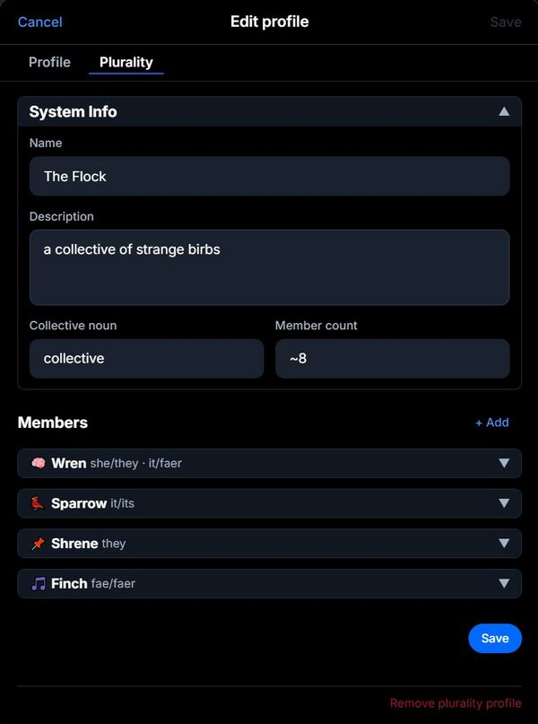
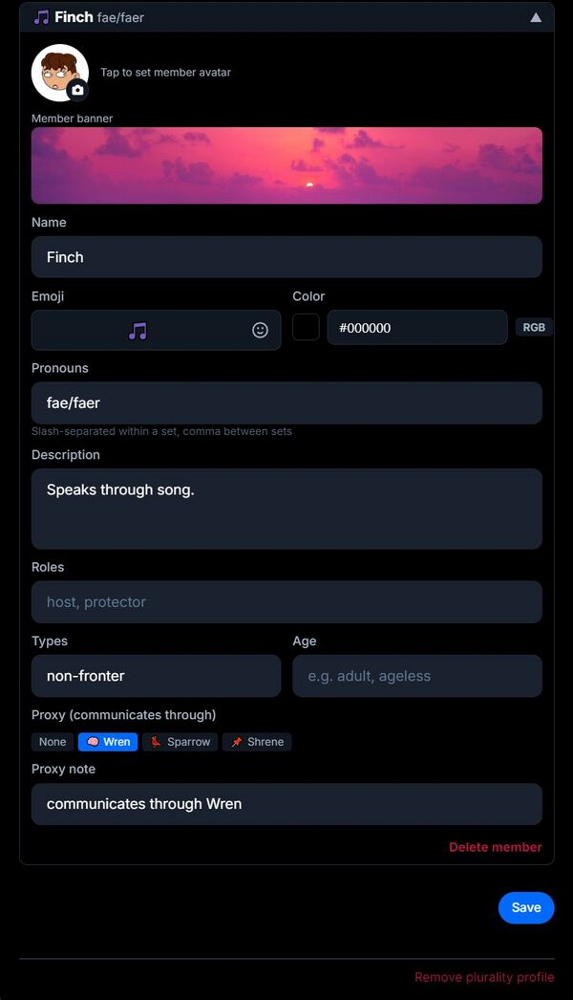
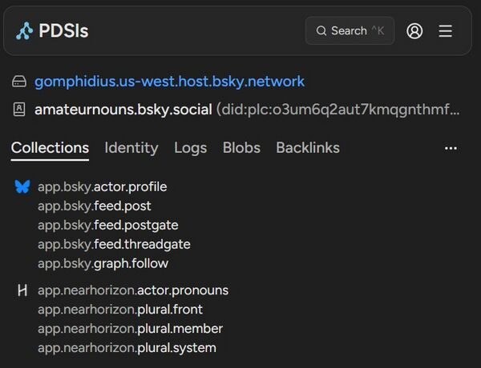

# ATProto Plural System Lexicon

**Namespace:** `app.nearhorizon.plural.*`
**License:** Apache 2.0

Plural systems on ATProto. Members, fronting state, and identity — stored on the user's PDS, not someone else's server.

## Why this exists

[Plurality](https://morethanone.info) is the experience of multiple distinct identities sharing a single body (and, on social platforms, a single account). These identities — called members, headmates, or alters depending on the community — may take turns controlling the account ("fronting"), be present simultaneously ("co-fronting"), or be aware without actively participating ("co-conscious").

Most social platforms have no concept of this. You get one name, one avatar, one set of pronouns, and that's it.

This lexicon gives plural systems a way to declare themselves, list their members, and indicate who's fronting — all as records in their own account repository. No labeler dependency, no external service. If a client doesn't understand the lexicon, it ignores it. Nothing breaks.

## Records

Three records, cleanly separated:

- **`system`** — "this account is a plural system" (singleton, `rkey: self`)
- **`member`** — one per member, keyed by a stable slug (e.g. `wren`, `sparrow`)
- **`front`** — who's fronting right now (singleton, `rkey: self`)

Static identity doesn't change when someone switches. Dynamic state doesn't bloat member records. They stay separate on purpose.

### `app.nearhorizon.plural.system`

| Field | Type | Description |
|-------|------|-------------|
| `name` | string | Display name for the system (e.g. "The Flock") |
| `description` | string | Free-form description |
| `collectiveNoun` | string | What to call the group (e.g. "collective", "household") |
| `memberCount` | string | Self-reported count — a string so you can say "20+" or "many" |
| `createdAt` | datetime | When the record was created |
| `updatedAt` | datetime | Last update |

No fields are required. The record existing is the signal.

### `app.nearhorizon.plural.member`

| Field | Type | Description |
|-------|------|-------------|
| `displayName` | string | **Required.** The member's name |
| `description` | string | Bio or description |
| `emoji` | string | Visual identifier emoji |
| `color` | string | Hex color (e.g. "#FFABDB") |
| `pronouns` | pronounSet[] | Pronoun sets — same format as [`app.nearhorizon.actor.pronouns`](https://github.com/skydeval/atproto-pronouns) |
| `roles` | string[] | System roles (e.g. "host", "protector") |
| `memberTypes` | string[] | Fronting behavior (e.g. "fronter", "co-fronter", "non-fronter") |
| `agePresentation` | string | How the member presents age-wise (e.g. "25", "ageless") |
| `proxy` | proxyRef | If this member communicates through another member |
| `avatar` | blob | Member avatar (PNG/JPEG, max 1MB) |
| `banner` | blob | Member banner (PNG/JPEG, max 1MB) |
| `createdAt` | datetime | When the record was created |
| `updatedAt` | datetime | Last update |

#### Pronoun sets

```json
{
  "pronouns": [
    { "forms": ["she", "they · it", "faer"] }
  ]
}
```

Same structure as the [pronouns lexicon](https://github.com/skydeval/atproto-pronouns). Each set is a `forms` array, displayed by joining with `/`. Free-text, no normalization. What people type in should show up as they typed them.

#### Proxy references

```json
{
  "proxy": {
    "id": "wren",
    "note": "speaks through"
  }
}
```

Some members can't front or communicate directly — they rely on another member to speak on their behalf. The proxy field records that relationship.

### `app.nearhorizon.plural.front`

| Field | Type | Description |
|-------|------|-------------|
| `members` | frontMember[] | **Required.** Who's in front right now |
| `state` | string | State descriptor (e.g. "solo", "co-fronting") |
| `comment` | string | Optional note about the current state |
| `setAt` | datetime | **Required.** When this front was set |

#### Front members

```json
{
  "members": [
    { "id": "wren", "status": "engaging" },
    { "id": "sparrow", "status": "co-conscious" },
    { "id": "shrene", "status": "dormant" }
  ]
}
```

`status` describes engagement level:

- **`engaging`** (or absent) — actively fronting: this member is currently "driving" the account
- **`co-conscious`** — aware and present, but not the one actively posting/interacting
- **`observing`** — passively watching, not participating
- **`dormant`** — listed in the front record but not currently active

These are conventions, not an enum. Clients should treat any unrecognized status as less present than `engaging`.

All member references are by rkey and are intra-DID — they point to records in the same account's repo. No cross-account references.

## Design principles

**User agency.** Data is stored as the user entered it. No normalizing names, expanding pronouns, or imposing categories.

**Presence, not permission.** The `system` record existing is what signals plurality. An empty one is valid.

**Stable identity.** Member rkeys are slugs that stay the same across edits. Front references use rkeys, not display names.

**Extensible by convention.** Roles, member types, and front statuses are free-text. Clients can suggest common values but must accept anything.

**Self-sovereign.** Everything lives in the user's account repository, on whatever PDS hosts it. No external service needed.

**Familiar formats.** Member pronouns use the same structure as [`app.nearhorizon.actor.pronouns`](https://github.com/skydeval/atproto-pronouns). If you already support that lexicon, you already know how to render these.

## Notes for implementers

### Record keys

Member rkeys should be lowercase alphanumeric slugs (e.g. `wren`, `sparrow`, `the-host`). ATProto constrains rkeys to alphanumeric characters, hyphens, underscores, and periods, max 512 characters. Don't use display names as rkeys — they change, slugs shouldn't.

### Front states

An empty `members` array (`"members": []`) means nobody is fronting. This is different from deleting the front record entirely — an empty front is an explicit "nobody's here right now," while a missing front record means the system hasn't set one up yet. Clients should handle both gracefully.

The order of members in the `members` array is not significant. Don't assume the first entry is the "primary" fronter — use the `status` field instead. All members with `status: "engaging"` (or no status) are equally fronting.

### Proxy members and fronting

A member with a `proxy` field (e.g. Finch communicates through Wren) might still appear in the front record. This isn't an error. Some systems track presence separately from communication ability. Clients should display proxy members in front normally and let the proxy info speak for itself.

### Displaying pronouns

Each pronoun set's `forms` array is displayed by joining with `/`: `["she", "her"]` → `she/her`. Multiple sets are separated with ` · ` or ` | ` depending on context. This matches the rendering rules in the [pronouns lexicon](https://github.com/skydeval/atproto-pronouns).

### Member avatars and banners

Member avatars and banners are stored as blobs on the user's PDS. To resolve them, use the standard blob URL:

```
https://{pds-host}/xrpc/com.atproto.sync.getBlob?did={did}&cid={blob-cid}
```

Where `blob-cid` comes from the `ref.$link` in the blob object on the member record.

### Display fallback

When a member is fronting, clients can swap the profile's display name, avatar, banner, and pronouns to that member's values. When nobody is fronting (or the front record is missing), fall back to the account's own profile data.

This is a client-level UX decision, not a protocol requirement. Some clients might show fronter info inline, others might not swap at all. The data supports both approaches.

### The ampersand

In the reference implementation, a `&` is appended to the fronter's display name (e.g. "Wren&") to signal that this is a system account showing a specific member. This is a UI convention, not part of the spec. Other clients can adopt it or use a different indicator.

### Member count

`memberCount` on the system record is self-reported as a string. It might not match the actual number of member records — not all members may be listed, or the system might use approximate values like "20+" or "many." Treat the self-reported count as authoritative for display. The actual record count is just what's published.

### Removing a plural profile

To fully remove a plural profile, delete all three record types: system, all members, and front. If a client sees member records but no system record, it should not treat the account as a plural system — the system record is the signal.

## Example

```json
// app.nearhorizon.plural.system/self
{
  "$type": "app.nearhorizon.plural.system",
  "name": "The Flock",
  "description": "a collective",
  "collectiveNoun": "collective",
  "memberCount": "5",
  "createdAt": "2026-02-18T21:31:55.361Z",
  "updatedAt": "2026-02-19T04:20:27.485Z"
}

// app.nearhorizon.plural.member/wren
{
  "$type": "app.nearhorizon.plural.member",
  "displayName": "Wren",
  "description": "Chaos gremlin with good intentions.",
  "emoji": "🏳️‍⚧️",
  "color": "#FFABDB",
  "pronouns": [{ "forms": ["she", "they · it", "faer"] }],
  "roles": ["host"],
  "memberTypes": ["fronter", "co-fronter"],
  "updatedAt": "2026-02-19T04:20:27.607Z"
}

// app.nearhorizon.plural.member/sparrow
{
  "$type": "app.nearhorizon.plural.member",
  "displayName": "Sparrow",
  "description": "The quiet observer.",
  "emoji": "🐦",
  "color": "#8B5E3C",
  "pronouns": [{ "forms": ["it", "its"] }],
  "roles": ["protector"],
  "memberTypes": ["fronter"],
  "updatedAt": "2026-02-19T04:20:27.723Z"
}

// app.nearhorizon.plural.front/self
{
  "$type": "app.nearhorizon.plural.front",
  "members": [
    { "id": "wren", "status": "engaging" },
    { "id": "sparrow", "status": "co-conscious" }
  ],
  "state": "co-fronting",
  "setAt": "2026-02-19T05:51:05.090Z"
}
```

## What it looks like

**Solo fronting:**

| Wren fronting (solo) | Sparrow fronting (solo) |
|---|---|
|  |  |

**Co-fronting:**

| Finch co-fronting | Wren blurry (co-fronting) |
|---|---|
|  |  |

**Nobody fronting:**



**Hover card:**



**Member list:**


**Edit profile:**

| Profile tab | Plurality tab |
|---|---|
|  |  |

**Member editor:**



**PDS collections ([PDSls](https://pdsls.dev)):**



## Adopting this

Any ATProto client can implement this. Standard `putRecord` / `getRecord` calls, no special infrastructure. If you do, open an issue or PR to get listed.

### Implementations

*None yet — be the first!*

## License

Apache 2.0
